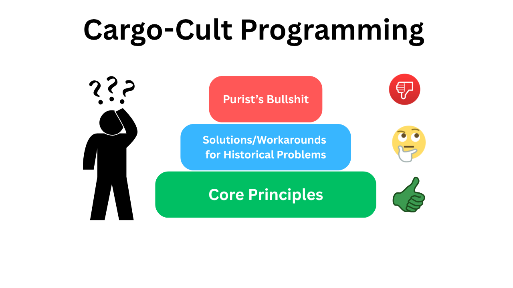
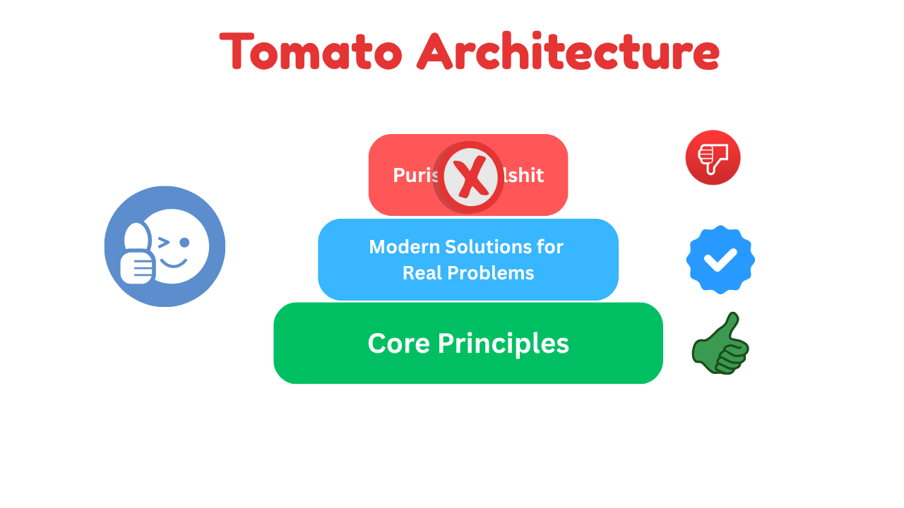

# Tomato Architecture


**Tomato Architecture** is a pragmatic approach to software architecture following the **Core Principles**

## Background
When I began exploring software architecture, I came across several well-known approaches such as [Clean Architecture](https://8thlight.com/blog/uncle-bob/2012/08/13/the-clean-architecture.html), [The Hexagonal (Ports & Adapters) Architecture](https://alistair.cockburn.us/hexagonal-architecture), and [Onion Architecture](https://jeffreypalermo.com/2008/07/the-onion-architecture-part-1/). At their core, these architectures share similar goals — promoting solid software design principles like separation of concerns, testability, and loose coupling.

Along with these principles, they also introduced certain practices that made sense for their time. For instance, when integration testing used to be difficult, isolating business logic from framework dependencies and "programming to interfaces" were great strategies to enable in-memory or mocked testing. Those ideas worked well for the challenges of that era.

However, over time, some of these practices have been taken to extremes. You'll often hear recommendations like:

* Your business logic should depend only on the JDK — no external libraries allowed
* Create your own logging abstraction
* Avoid framework annotations and write XML instead to keep your core 'pure'

While these ideas may sound elegant in theory, in practice they often add unnecessary complexity.
Modern frameworks and libraries already solve many of these recurring problems. In the real world, companies rarely switch frameworks, databases, or message brokers overnight. Building multiple abstraction layers just to guard against that possibility usually results in more boilerplate and less productivity.

I've seen teams implementing Clean, Hexagonal, or Onion architectures spend a surprising amount of time on:

* Endless copying of data from one layer to another
* Creating unnecessary interfaces
* Creating endless interfaces with only one implementation
* Re-implementing features (like cross-cutting concerns) that frameworks already handle elegantly.

With the tools we have today — Mockito for mocking concrete classes, Testcontainers for testing with real dependencies, and frameworks like Spring Boot or Quarkus that already abstract away much of the complexity — many of these additional layers are simply unnecessary.



So I decided to take a more pragmatic approach:
**Keep the timeless principles, embrace modern tooling, and focus on building simple, testable, and maintainable software — without the dogma or ceremony.**

That's how **Tomato Architecture** was born:
**A blend of the best ideas from existing architectures, minus the cargo-cult, idealistic, and purist mindset.**

## Core Principles
* Focus on simplicity — solve today's problems without overengineering for hypothetical future needs.
* Research, evaluate, and then commit to the right technologies instead of building layers of unnecessary abstraction for the sake of "future replaceability."
* Design systems that work cohesively as a whole, not just as isolated, well-tested components.
* Make architectural decisions based on what truly benefits your software — not merely because it's a trend or endorsed by popular voices.



## Architecture Diagram
A simple layered architecture with strict modularity goes a long way towards achieving the Tomato Architecture goals.


## Implementation Guidelines

### 1. Package by feature
A common way to organize code is by technical layers — separating controllers, services, repositories, and so on.
While this approach can work well for a microservice that already represents a single, well-defined business capability, it often becomes cumbersome in larger applications.

For monolithic or modular-monolithic architectures, it is strongly recommended to organize code by feature rather than by technical layer. This structure keeps related functionality together, making the codebase easier to navigate, maintain, and evolve.

For a deeper dive, check out: [https://phauer.com/2020/package-by-feature/](https://phauer.com/2020/package-by-feature/)

### 2. "Application Core" for Business Logic
Keep the **Application Core** completely independent of any delivery mechanism — whether it's a web API, scheduled job, or command-line interface.

The core should expose well-defined APIs that can be invoked directly from a simple `main()` method.
To achieve this, the Application Core must remain agnostic to its execution context — it should not depend on HTTP frameworks, web libraries, or any delivery-specific components.

Likewise, if the same core logic is reused in scheduled jobs or CLI tools, ensure that scheduling or command execution details never leak into the Application Core.

### 3. Separation of Concerns
Keep the business logic execution independent of how the input arrives — whether through web controllers, message listeners, or scheduled jobs.

Input sources should act as thin layer to extract the required data from the request source and delegate all business logic to the Application Core.

**🚫 DON'T DO THIS**

```java
@RestController
class CustomerController {
    private final CustomerService customerService;
    
    @PostMapping("/api/customers")
    void createCustomer(@RequestBody Customer customer) {
       if(customerService.existsByEmail(customer.getEmail())) {
           throw new EmailAlreadyInUseException(customer.getEmail());
       }
       customer.setCreateAt(Instant.now());
       customerService.save(customer);
    }
}
```

**✅ INSTEAD, DO THIS**

```java
@RestController
class CustomerController {
    private final CustomerService customerService;
    
    @PostMapping("/api/customers")
    void createCustomer(@RequestBody Customer customer) {
       customerService.save(customer);
    }
}

@Service
class CustomerService {
   private final CustomerRepository customerRepository;

    @Transactional
   void save(Customer customer) {
      if(customerRepository.existsByEmail(customer.getEmail())) {
         throw new EmailAlreadyInUseException(customer.getEmail());
      }
      customer.setCreateAt(Instant.now());
      customerRepository.save(customer);
   }
}
```

With this approach, whether a customer is created via REST, CLI, or any other interface, the business logic remains centralized in the Application Core.

**🚫 DON'T DO THIS**

```java
@Component
class OrderProcessingJob {
    private final OrderService orderService;
    
    @Scheduled(cron="0 * * * * *")
    void run() {
       List<Order> orders = orderService.findPendingOrders();
       for(Order order : orders) {
           this.processOrder(order);
       }
    }
    
    private void processOrder(Order order) {
       ...
       ...
    }
}
```

**✅ INSTEAD, DO THIS**

```java
@Component
class OrderProcessingJob {
   private final OrderService orderService;

   @Scheduled(cron="0 * * * * *")
   void run() {
      List<Order> orders = orderService.findPendingOrders();
      orderService.processOrders(orders);
   }
}

@Service
@Transactional
class OrderService {

   public void processOrders(List<Order> orders) {
       ...
       ...
   }
}
```

This decouples order processing logic from the scheduler, allowing you to test and reuse it independently of any scheduling mechanism.

Your Application Core may interact with databases, message brokers, or third-party services — but ensure these integrations don't leak into your business logic.

For example, when using a persistence framework like Spring Data JPA, avoid tying your service logic directly to its APIs.

**🚫 DON'T DO THIS**

```java
@Service
@Transactional
class CustomerService {
   private final CustomerRepository customerRepository;

   PagedResult<Customer> getCustomers(Integer pageNo) {
      Pageable pageable = PageRequest.of(pageNo, PAGE_SIZE, Sort.of("name"));
      Page<Customer> cusomersPage = customerRepository.findAll(pageable);
      return convertToPagedResult(cusomersPage);
   }
}
```

**✅ INSTEAD, DO THIS**

```java
@Service
@Transactional
class CustomerService {
   private final CustomerRepository customerRepository;

   PagedResult<Customer> getCustomers(Integer pageNo) {
      return customerRepository.findAll(pageNo);
   }
}

@Repository
class JpaCustomerRepository {

   PagedResult<Customer> findAll(Integer pageNo) {
      Pageable pageable = PageRequest.of(pageNo, PAGE_SIZE, Sort.of("name"));
      return ...;
   }
}
```

This way, changes to your persistence framework or infrastructure only affect the repository layer, leaving your business logic clean and stable.

### 4. Domain logic in domain objects
Keep domain behavior close to the data it operates on — inside your domain objects.

**🚫 DON'T DO THIS**

```java

class Cart {
    List<LineItem> items;
}

@Service
@Transactional
class CartService {

   CartDTO getCart(UUID cartId) {
      Cart cart = cartRepository.getCart(cartId);
      BigDecimal cartTotal = this.calculateCartTotal(cart);
      ...
   }
   
   private BigDecimal calculateCartTotal(Cart cart) {
      ...
   }
}
```

In this example, the `calculateCartTotal()` method contains pure domain logic based solely on the state of `Cart`.
Such logic belongs inside the `Cart` domain object itself — not in a service class.

**✅ INSTEAD, DO THIS**

```java

class Cart {
    List<LineItem> items;

   public BigDecimal getTotal() {
      ...
   }
}

@Service
@Transactional
class CartService {

   CartDTO getCart(UUID cartId) {
      Cart cart = cartRepository.getCart(cartId);
      BigDecimal cartTotal = cart.getTotal();
      ...
   }
}
```

### 5. No unnecessary interfaces
Don't create interfaces just because "we might need another implementation someday."
If that day ever comes, modern IDEs make it trivial to extract an interface with just a few keystrokes.

If your only reason for introducing an interface is to make testing easier — you don't need to.
Mocking frameworks like Mockito can mock concrete classes just fine.

In short, only create interfaces when you have a clear and valid reason — not out of habit or hypothetical future needs.

### 6. Embrace framework's power and flexibility
Frameworks and libraries are built to solve the common challenges that most applications face.
When you adopt one to accelerate development, make full use of its strengths — embrace it rather than hide it.

Creating extra layers of abstraction on top of your chosen framework, just in case you might switch to another someday, is usually counterproductive. It adds complexity without real benefit and often prevents you from leveraging the framework's full potential.

For example, the Spring Framework already provides powerful, declarative support for transactions, caching, and method-level security.
Re-creating these mechanisms through custom annotations that merely delegate to Spring's features offers no real advantage.

Instead, use the framework directly — or if you need additional semantics, compose your own annotations on top of it, like this:

```java
@Target(ElementType.TYPE)
@Retention(RetentionPolicy.RUNTIME)
@Documented
@Transactional
public @interface UseCase {
   @AliasFor(
        annotation = Transactional.class
   )
   Propagation propagation() default Propagation.REQUIRED;
}
```

This approach keeps your code expressive while still taking full advantage of the framework's capabilities.

### 7. Test not only units, but whole features

Unit tests are essential — they validate individual pieces of business logic, often by mocking external dependencies. But beyond that, it's even more important to ensure that a complete feature actually works as expected.

Fast unit tests alone don't guarantee production readiness. To gain real confidence, test your features end-to-end, using real dependencies like databases, message brokers, or external services.

The popular idea that "the core domain must be completely independent of external dependencies" likely originated when testing with real infrastructure was difficult or impractical. Fortunately, that's no longer the case — tools like [Testcontainers](https://testcontainers.com/) make it easy to spin up real dependencies during tests.

Running such tests might take a bit longer, but the confidence and reliability they provide are well worth the trade-off.
